# Particle-Swarm-Optimisation
A simple Particle Swarm Optimisation algorithm, finding the minimum of several functions in the N-dimensional space. 

## Benchmark Functions
Several benchmark functions were used to evaluate the effectiveness of the algorithm. 

### Ackley
$$
f_{Ackley}(x) = - 20 \times e^{- 0.2 \times \sqrt{\frac{1}{n} \sum_{i=1}^{n} {x_{i}^{2}}}} \times e^{\frac{1}{n} \sum_{i = 1}^{n} \cos{2\pi x_{i}}} + 20 + e
$$

|                          |
| --------------------------------------------------------------|
| Ackley Particle Swarm Optimisation in the 2-dimensional space |

### Griwank
$$
f_{Griewank}(x) = 1 + \frac{1}{4000} \sum_{i = 1}^{n} {x_{i}^{2}} - \prod_{i = 1}^{n} {\cos \frac{x_{i}}{\sqrt{i}}}
$$

| 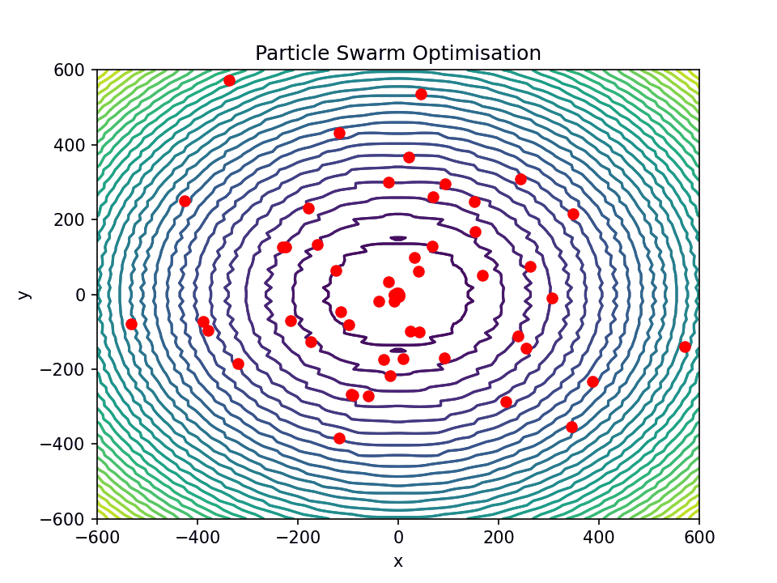                       |
| ----------------------------------------------------------------|
| Griewank Particle Swarm Optimisation in the 2-dimensional space |

### Michalewicz
$$
f_{Michalewicz}(x) = - \sum_{i = 1}{n} \sin {x_{i}} \times {(\sin {\frac {ix_{i}^{2}}{\pi}})}^{2m}
$$

, $where\ m = 10$

| 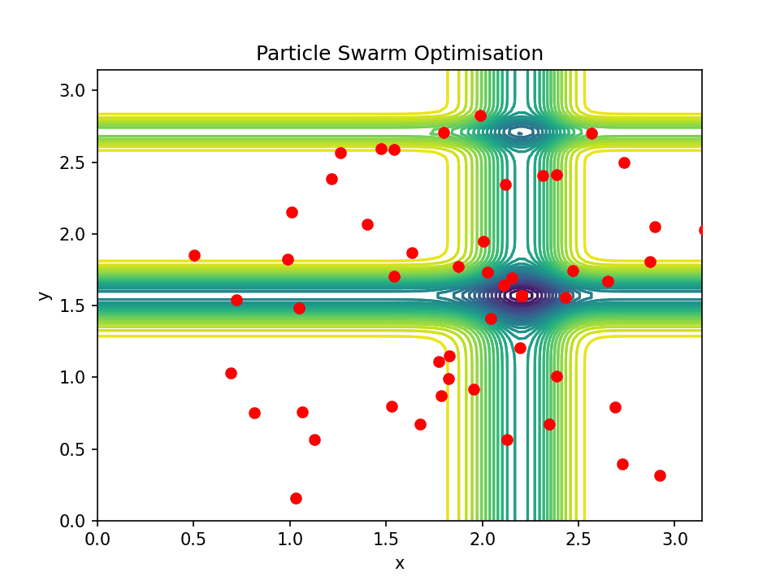                   |
| ------------------------------------------------------------------|
| Michalewicz Particle Swarm Optimisation in the 2-dimensional space|
### Rastrigin
$$
f_{Rastrigin}(x) = a \times n + \sum_{i = 1}^{n} {x_{i}^{2} - a \cos {2 \pi x_{i}}}
$$

, $where\ a = 10$

|                         |
| -------------------------------------------------------------|
| Rastrigin Particle Swarm Optimisation in the 2-dimensional space|

### Rosenbrock
$$
f_{Rosenbrock}(x) = \sum_{i=1}^{n-1} (100(x_{i+1} - x_{i}^{2}) + (x_{i} - 1)^{2})
$$

| 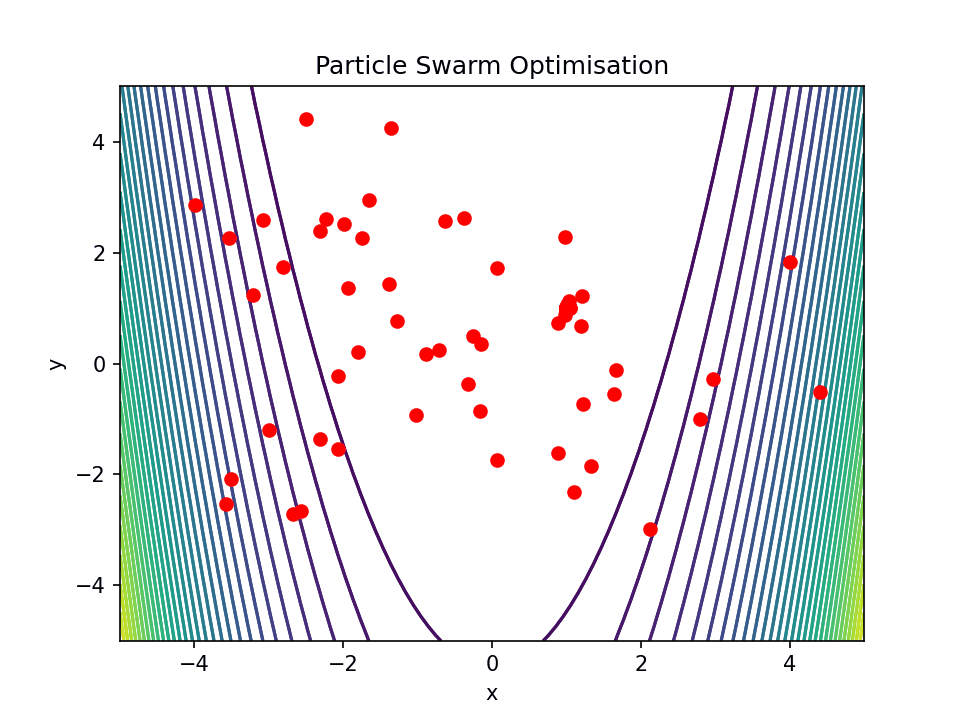                    |
| -----------------------------------------------------------------|
| Rosenbrock Particle Swarm Optimisation in the 2-dimensional space|

### Sphere
$$
f_{Sphere}(x) = \sum_{i=1}^{n} {x_{i}^{2}}
$$

| 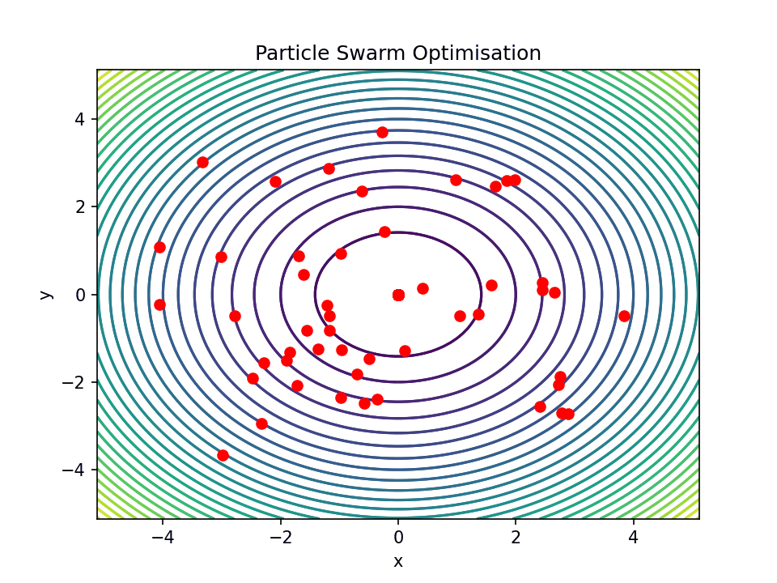                    |
| -------------------------------------------------------------|
| Sphere Particle Swarm Optimisation in the 2-dimensional space|

## Evaluate
The algorithm is evaluated against two criteria: 

1) Average Loss

Average Loss is calculated as follows $\overline{f(p)} - f(global_{min})$ where $p$ is a particle's current position and $global_{min}$ is the technical global minimum of the function. 

The graphs shown are all in the 10 Dimensional Space.

### Ackley

| 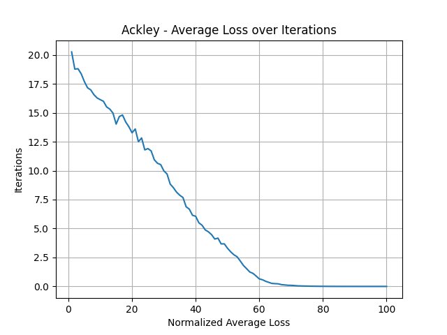        |
| ---------------------------------------------------------------|
| Ackley Average Loss in the 10 Dimensional Space over Iterations|

### Griewank

| 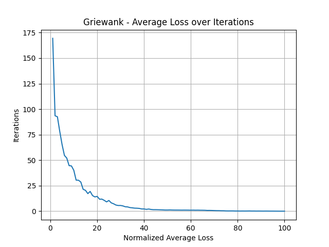      |
| -----------------------------------------------------------------|
| Griewank Average Loss in the 10 Dimensional Space over Iterations|

### Michalewicz

| 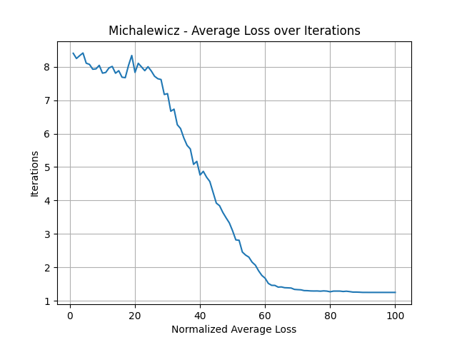   |
| --------------------------------------------------------------------|
| Michalewicz Average Loss in the 10 Dimensional Space over Iterations|

### Rastrigin

| 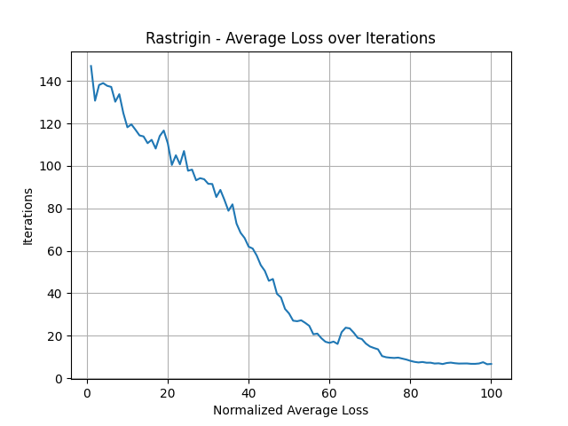     |
| ------------------------------------------------------------------|
| Rastrigin Average Loss in the 10 Dimensional Space over Iterations|

### Rosenbrock

| 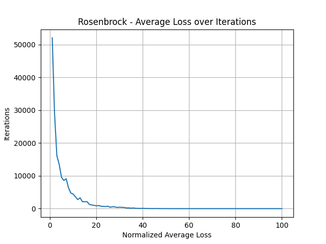    |
| -------------------------------------------------------------------|
| Rosenbrock Average Loss in the 10 Dimensional Space over Iterations|

### Sphere

| 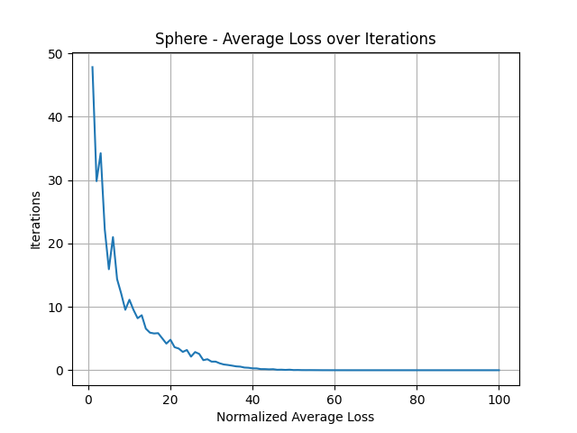        |
| ---------------------------------------------------------------|
| Sphere Average Loss in the 10 Dimensional Space over Iterations|

2) Number of Successes

The number of successes is evaluated base on how close the global best position of the terminated particle swarm optimisation is to the technical global minimum of the function. The condition is rather harsh, having used the NumPy `allclose` function to evaluate the closeness of the final position to the actual position. The result is shown in the graph below:

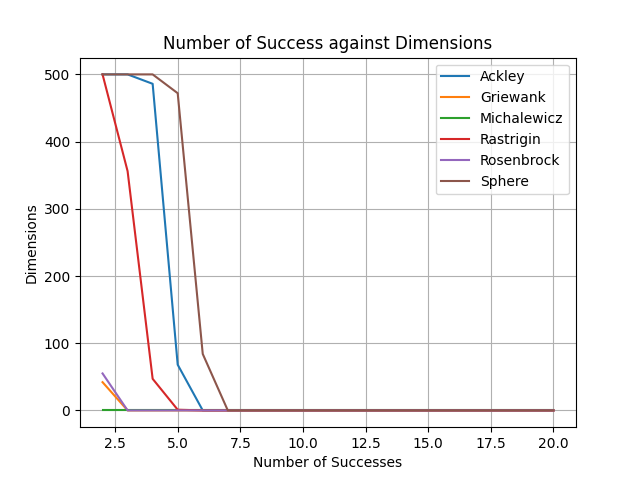
