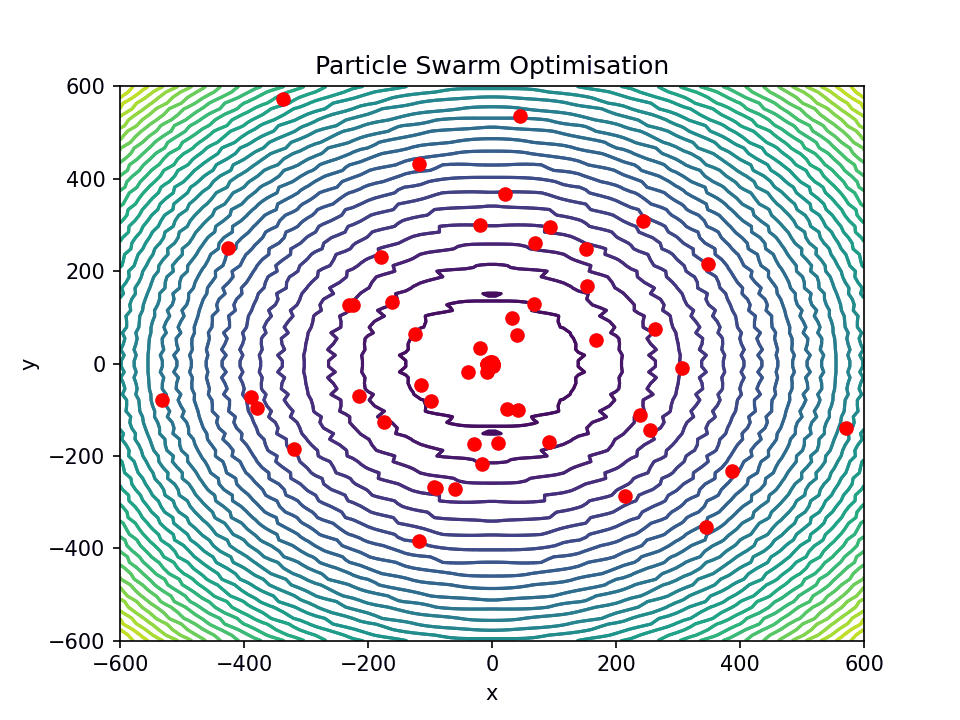
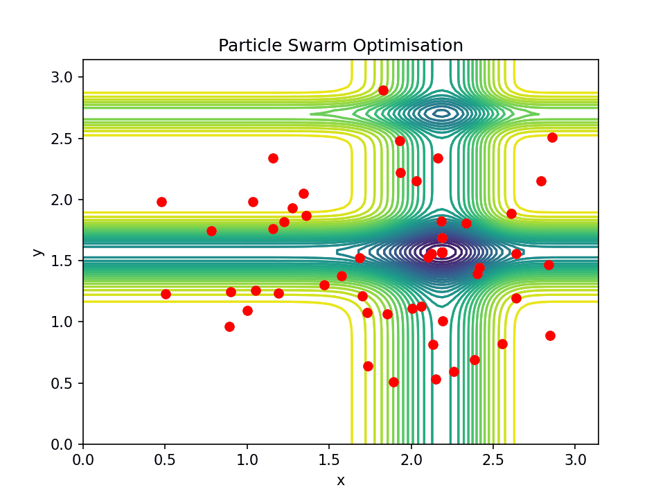
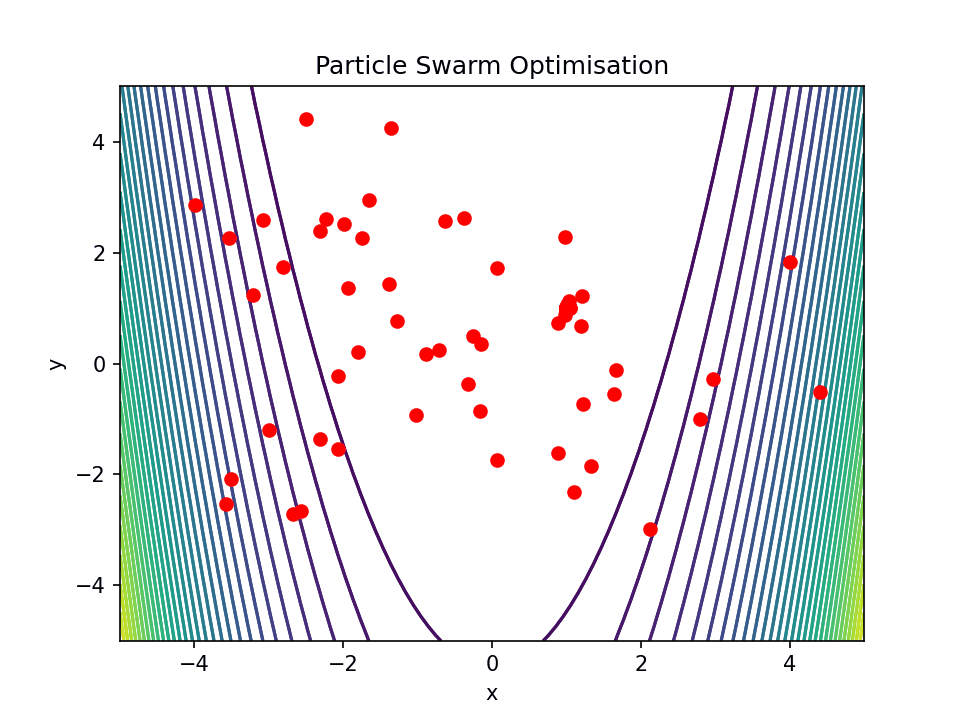
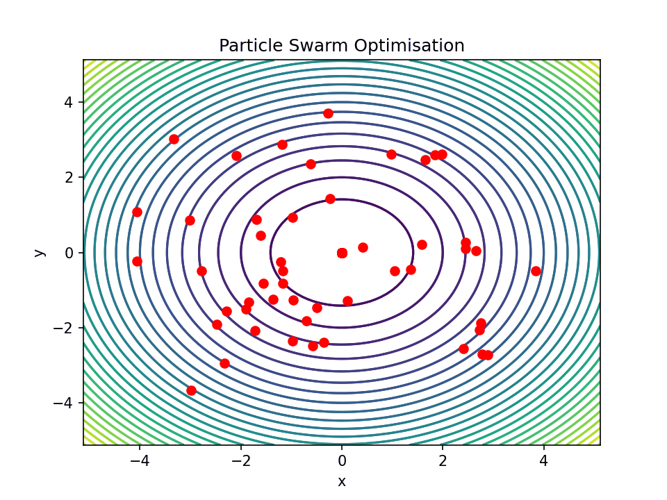

# Particle-Swarm-Optimisation
A simple Particle Swarm Optimisation algorithm, finding the minimum of several functions in the N-dimensional space. 

## Benchmark Functions
Several benchmark functions were used to evaluate the effectiveness of the algorithm. 

### Ackley
$$
f_{Ackley}(x) = - 20 \times e^{- 0.2 \times \sqrt{\frac{1}{n} \sum_{i=1}^{n} {x_{i}^{2}}}} \times e^{\frac{1}{n} \sum_{i = 1}^{n} \cos{2\pi x_{i}}} + 20 + e
$$

|                          |
| --------------------------------------------------------------|
| Ackley Particle Swarm Optimisation in the 2-dimensional space |

### Griwank
$$
f_{Griewank}(x) = 1 + \frac{1}{4000} \sum_{i = 1}^{n} {x_{i}^{2}} - \prod_{i = 1}^{n} {\cos \frac{x_{i}}{\sqrt{i}}}
$$

|                          |
| ------------------------------------------------------------------|
| Griewank Particle Swarm Optimisation in the 2-dimensional space   |

### Michalewicz
$$
f_{Michalewicz}(x) = - \sum_{i = 1}{n} \sin {x_{i}} \times {(\sin {\frac {ix_{i}^{2}}{\pi}})}^{2m}
$$

, $where\ m = 10$

|                    |
| ------------------------------------------------------------------|
| Michalewicz Particle Swarm Optimisation in the 2-dimensional space|
### Rastrigin
$$
f_{Rastrigin}(x) = a \times n + \sum_{i = 1}^{n} {x_{i}^{2} - a \cos {2 \pi x_{i}}}
$$

, $where\ a = 10$

|                         |
| -------------------------------------------------------------|
| Ackley Particle Swarm Optimisation in the 2-dimensional space|

### Rosenbrock
$$
f_{Rosenbrock}(x) = \sum_{i=1}^{n-1} (100(x_{i+1} - x_{i}^{2}) + (x_{i} - 1)^{2})
$$

|                     |
| -----------------------------------------------------------------|
| Rosenbrock Particle Swarm Optimisation in the 2-dimensional space|

### Sphere
$$
f_{Sphere}(x) = \sum_{i=1}^{n} {x_{i}^{2}}
$$

|                         |
| -------------------------------------------------------------|
| Sphere Particle Swarm Optimisation in the 2-dimensional space|